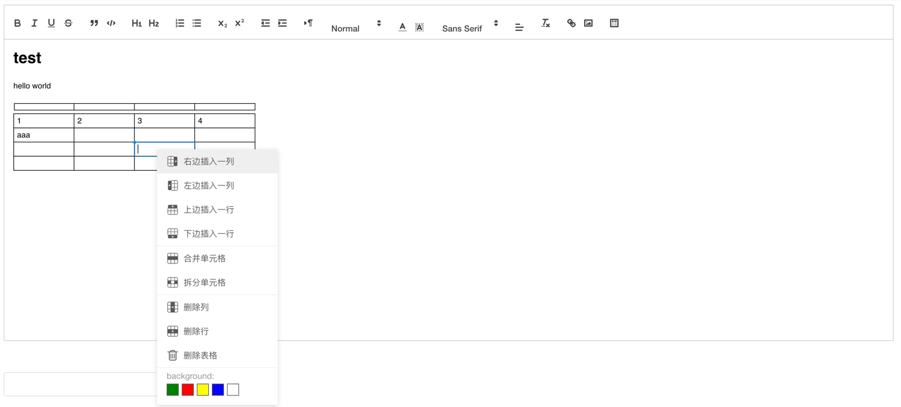

# vue-quill-editor-support-insert-table

- [forked from](https://github.com/surmon-china/vue-quill-editor)

该VUE组件是兼容支持 使用 [quill-better-table](https://www.npmjs.com/package/quill-better-table) 组件将表格嵌入内容中。
[vue-quill-editor-support-insert-table组件包地址](https://www.npmjs.com/package/vue-quill-editor-support-insert-table)

原 vue-quill-editor 的 quill 版本是使用的版本 1.3.7，
但是这个版本是无法支持使用 quill-better-table 组件进行表格插入；
故fork出来，修改版本号至 2.0.0-dev.4，该版本是开发版本，并非 [quill](https://www.npmjs.com/package/quill) 线上正式版本，如果非特殊原因，不建议使用该组件，可能会存在未知的bug。

使用方式：

1.引入组件

npm i vue-quill-editor-support-insert-table

npm i quill-better-table

2.使用样例：

TODO（等空闲了写一个样例页面）

3.效果图：

